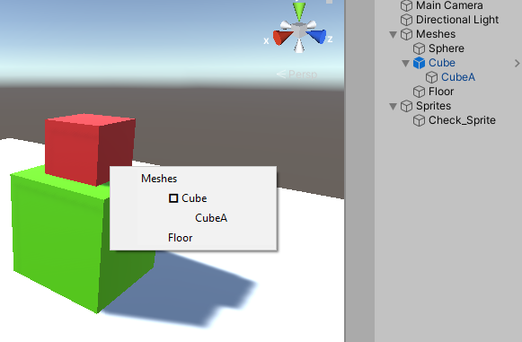

This is an old repository for the tool, maybe in the future i can update this project, but for now, i recommend using: https://github.com/MatiM36/ContextClickSelectV2

# Unity Context Click selection tool

A simple Unity tool to select objects from a dropdown using the secondary click, like in Photoshop

## Getting Started

Just import the latest ContextClickTool package into your project and you're ready to go

### How to use

Just use right click over an object, and it will display a list of all the objects that are in that point, in their corresponding hierarchy
